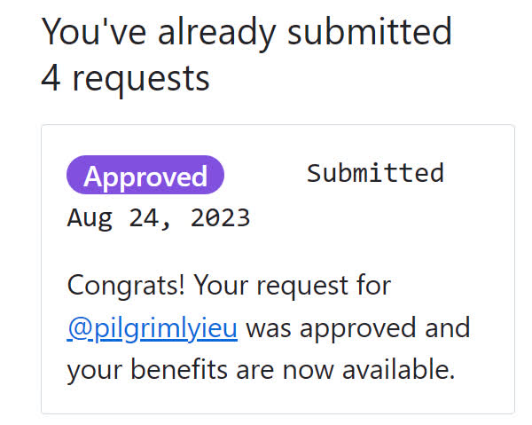
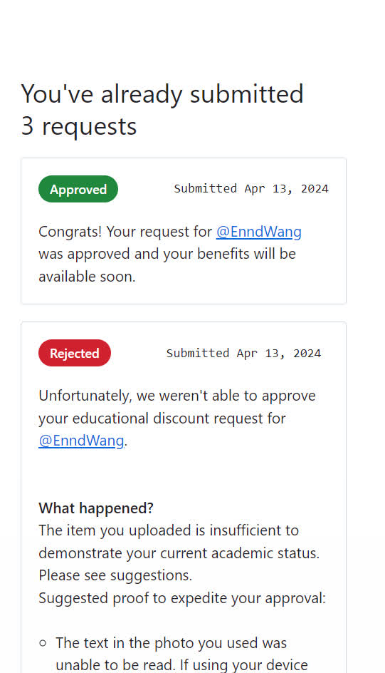
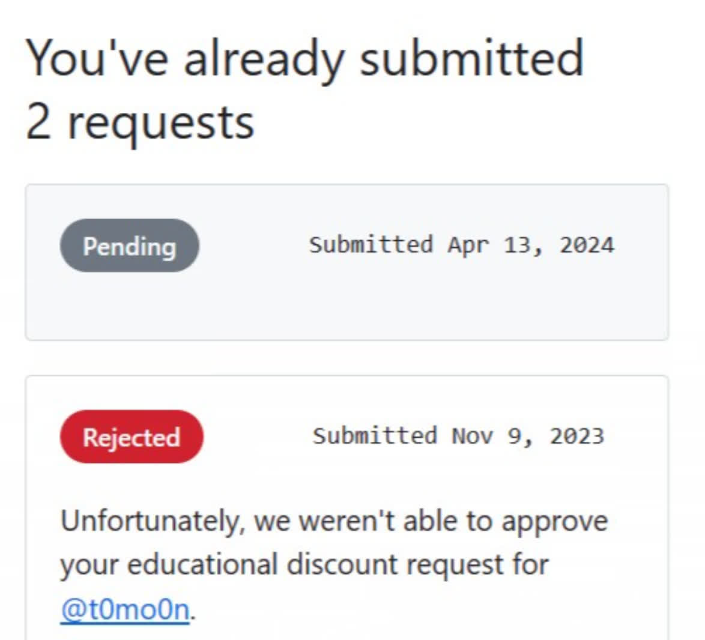
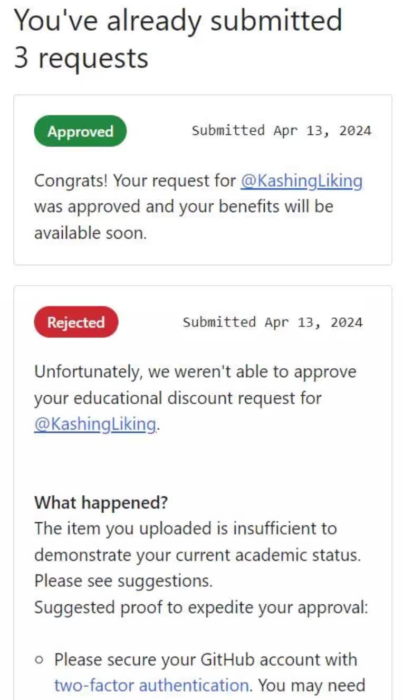
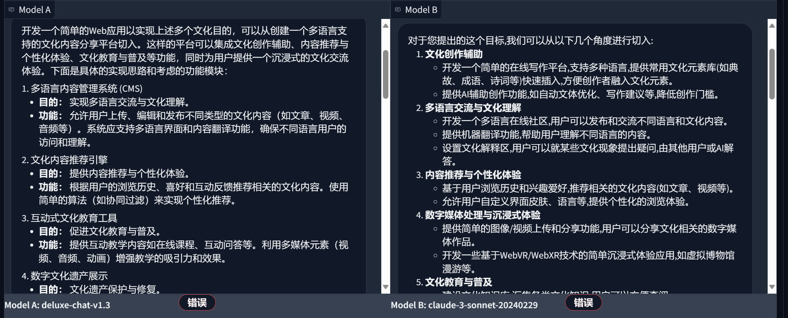
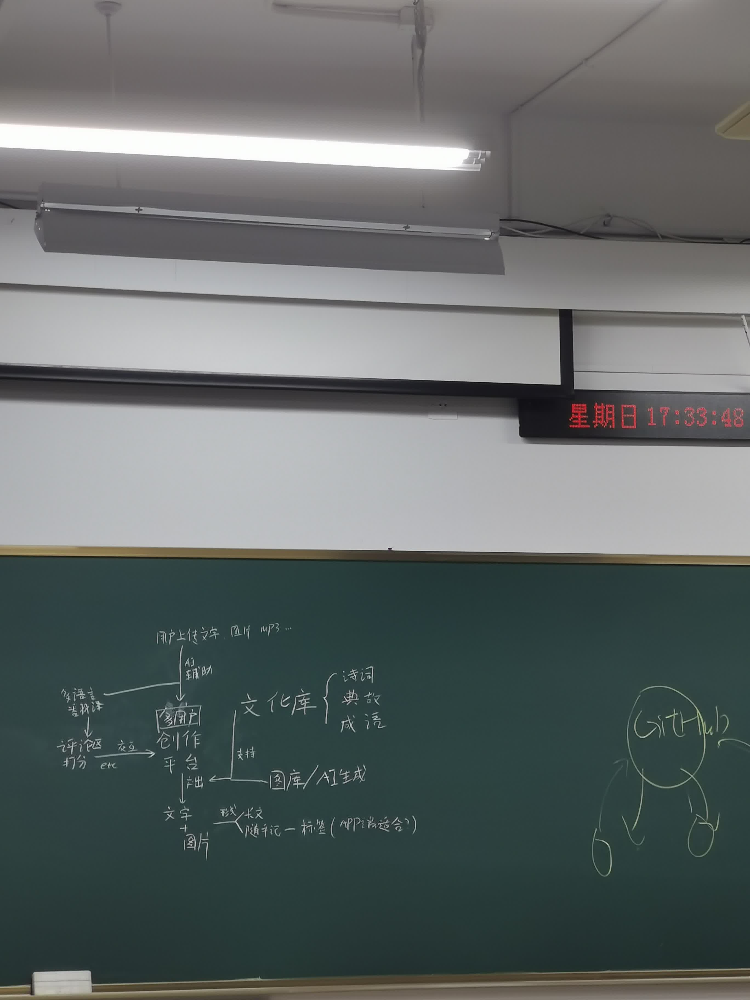
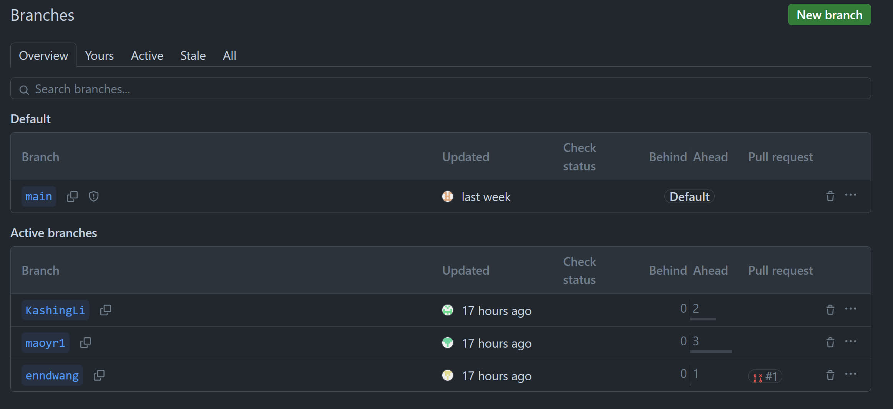
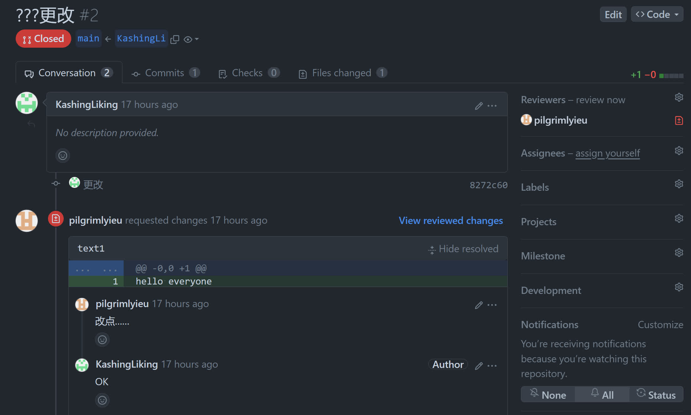

# 4 月 13 日组会

- 记录人：[@PilgrimLyieu](https://github.com/pilgrimlyieu)
- 记录时间：2024 年 4 月 13 日

<!-- ## 第一周任务 -->

<!-- 1. 确定选题与大致思路，头脑风暴一下，每个人都提出一点自己的想法、见解（最重要的一点！不用太过详细，细节、分工等工作在下周进行） -->
<!-- 2. 注册 GitHub 账户并告诉我，我拉每个人 Collaborator，所有代码任务包括项目文档均使用 GitHub 进行管理。（有困难可以搜索或者发群里，总之得尽快解决）（同时到时候每个人创建一个分支，在自己的分支进行工作，并在完成阶段性目标时提 Pull Request 并入主分支。这点不急，等项目细节敲定后才会正式开始。只不过 GitHub 账户与 Collaborator 这周一定得弄完） -->
<!-- 3. 使用 VSCode（虽然说强制这个似乎不太好，但是据我观察似乎也没有比 VSCode 更合适的了）作为代码开发工具，因为有很多有用的插件比如 Copilot 以及代码格式化等，有利于规范代码开发（也是跟上面一样，还没写代码所以只是准备工作） -->
<!-- 4. 这点不强制，但是如果希望能有 A 助力代码开发的话，例如说编程出现问题进行咨询、提供编程建议、优化代码等，可以考虑弄个 GitHubStudentPack, 里面就包括了 Copilot.（也是一样。有困难就查+问） -->
<!-- 5. 这点也不强制，那就是 Al 工具，会用 ChatGPT, NewBing 等自然最好，只是再推荐一个 https://arena.lmsys.org, 有概率能刷出 GPT-4 等强力 BOSS -->
<!-- 6. 这点只是置顶问一下，有人会 LaTeX 或 Typst 等排版工具吗，没有的话那就我来排版文档之类的东西了（其实也不一定要用前面几个，markdown 也行，到时候我看看排版需求用不用的上 LaTeX） -->

## 会议内容

1. 组长协助组员完成 GitHub Student Pack 的申请
2. 讨论并确定项目选题、方向分工等
3. 组长简单介绍开发流程，使用 Git 进行版本控制
4. 进行简单的分工确定

## GitHub Student Pack

## 选题方向

在 AI 的帮助下，确定了基本框架是制作一个**用户创作平台**，并包含以下特性（在开发过程中可能进行舍弃）：

1. 创作
    - 以文字为基础，并提供图片、音频、视频等多媒体支持
    - 支持标签、分类系统
    - 支持富文本、markdown 等格式
    - 支持 OCR 导入旧文档
2. 辅助
    - 支持文化库，根据类型提供合适的诗词、典故、成语等
        - 允许用户自定义文化库
        - 允许用户分享文化库
        - 允许用户从文化库中诗词等了解更多信息
    - 支持 AI 生成思路、摘要、题图、插图等
3. 多用户
    - 支持多用户协作共同创作
    - 支持多用户交互如评论、点赞等
4. 多语言
    - 支持多语言创作（可以自行创作双语版本，或使用机器翻译）

## 流程控制

使用 Git 进行版本控制。

1. 每个人创建一个分支，在自己的分支进行工作
2. 原子化提交，提交信息要有意义，提交内容要有意义
3. 在完成阶段性目标时提 Pull Request 并入主分支
4. 组长进行代码审查，通过后合并到主分支
5. 合并后每个人拉取主分支，更新自己的分支

在组长的协助下每个人创建了自己的分支：

并尝试了 Pull Request 与组长代码审查：

## 项目分工

初步分工如下：

- 前端使用 Vue.js
- 后端使用 Flask

1. 组长 [@PilgrimLyieu](https://github.com/pilgrimlyieu)
    - 项目统筹规划
    - 撰写项目报告与各种文档
    - 搜寻有关资料
    - 同时参与前后端开发
    - 项目流程控制
    - 项目代码审查
2. 组员 [@EnndWang](https://github.com/EnndWang)
    - 前后端知识学习
    - 前端开发
3. 组员 [@KashingLiking](https://github.com/KashingLiking)
    - 前后端知识学习
    - 后端开发
4. 组员 [@t0mo0n](https://github.com/t0mo0n)
    - 前后端知识学习
    - 后端开发
    - 答辩 PPT 制作
