# 4 月 20 日组会

- 记录人：[@PilgrimLyieu](https://github.com/pilgrimlyieu)
- 记录时间：2024 年 4 月 20 日

## 会前

### Copilot

鉴于组长与组员均没有 Web 开发的经验，向 Copilot 进行咨询就成为了必不可少的一步。如下图是向 Copilot 了解 API Reference 的构成，与 API 的编写等。

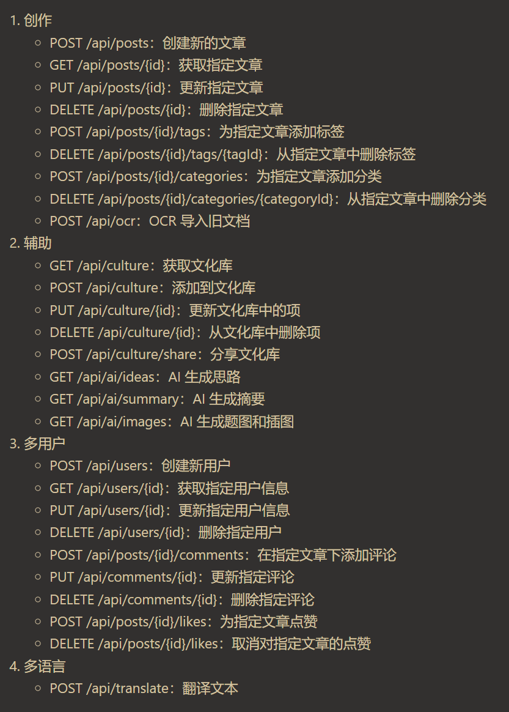

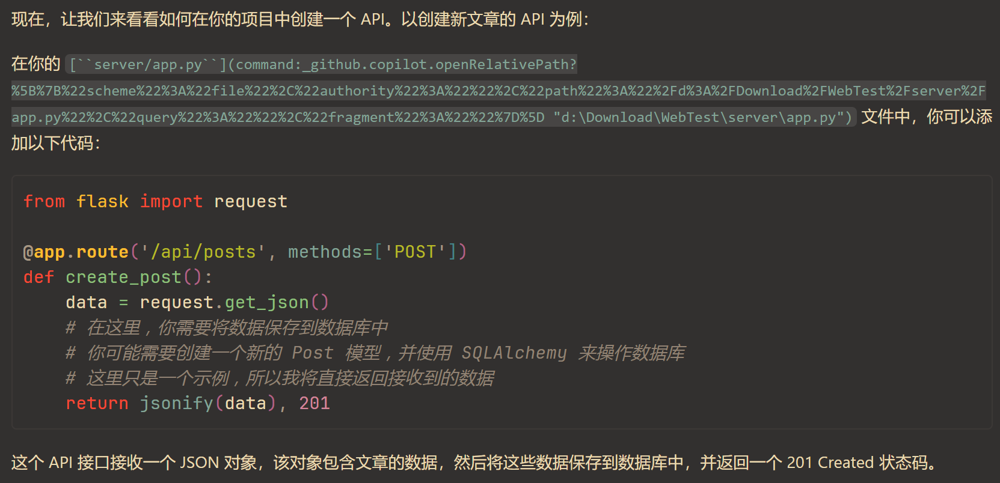

以及后端编写拆分为多个模块的思路，也由 Copilot 提供帮助。

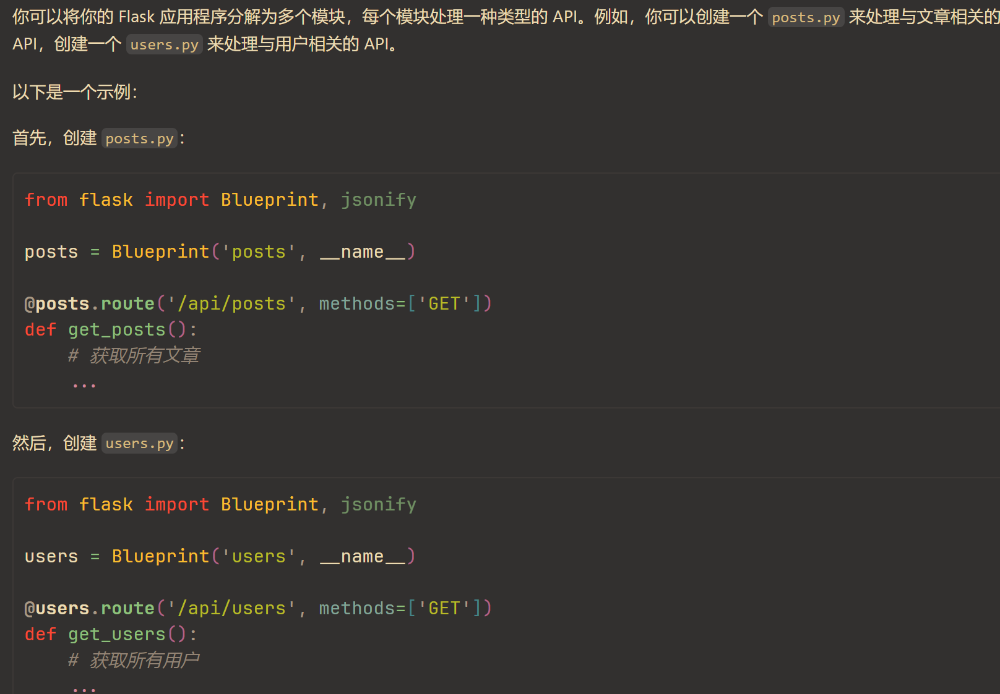

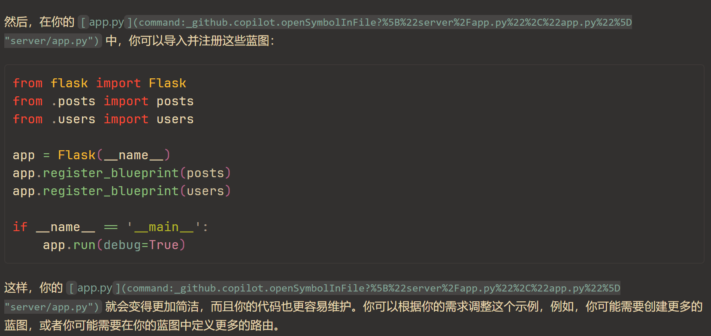

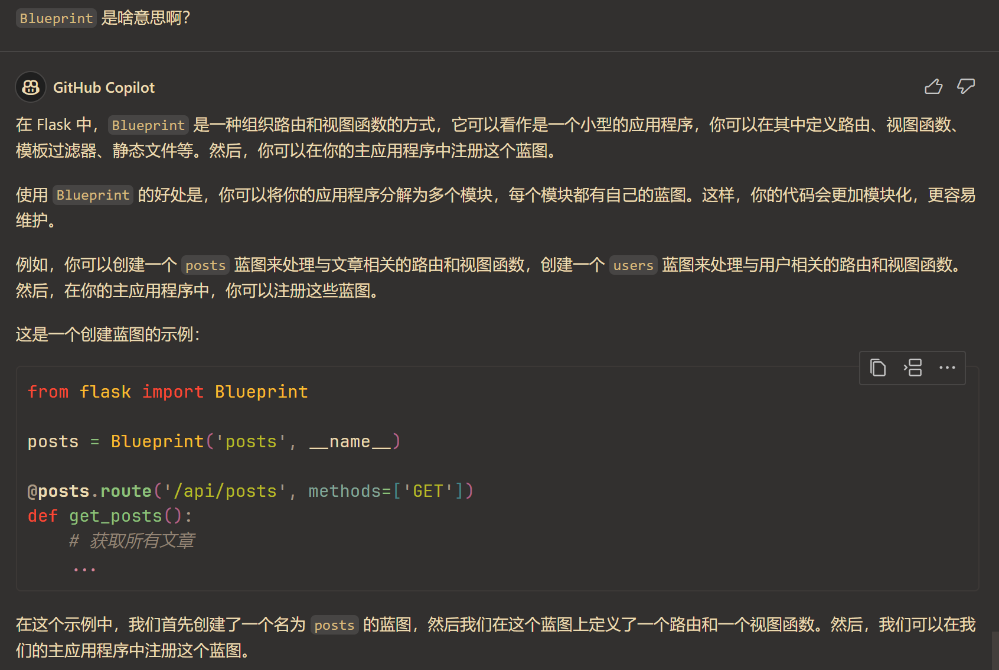

后端外，还有就是组长本人觉得格外棘手的前端了。

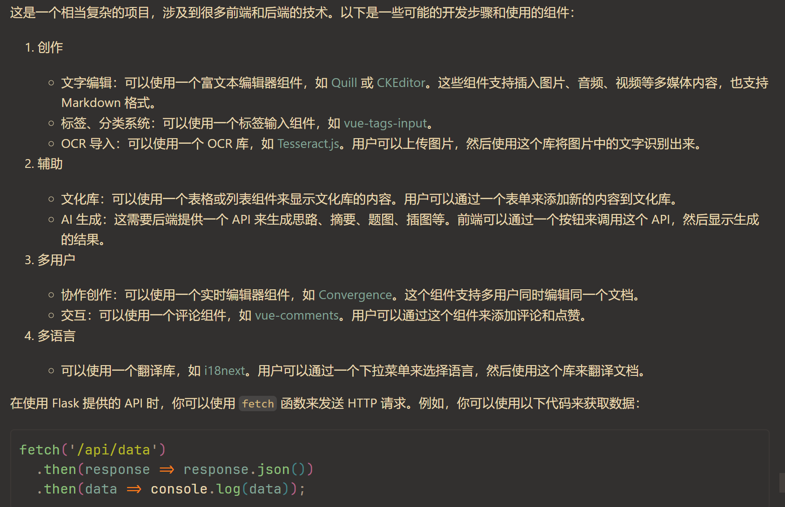

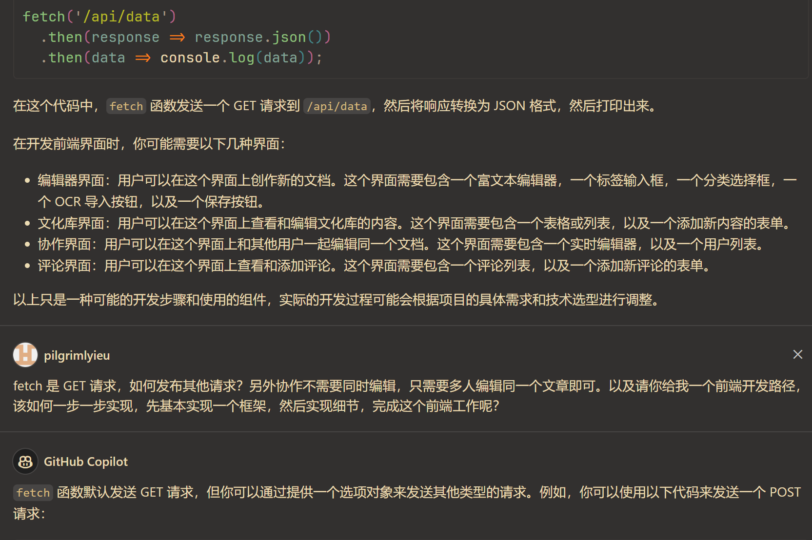

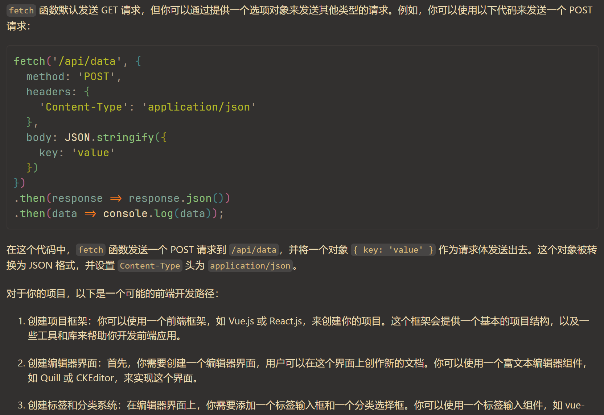

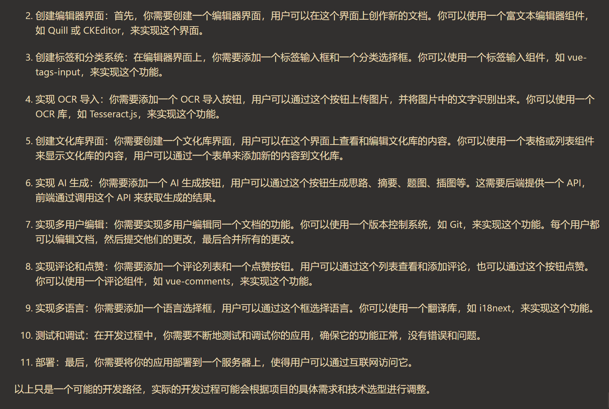

虽然一行代码都还没开始写，但是还是提前了解了一下发布的流程。

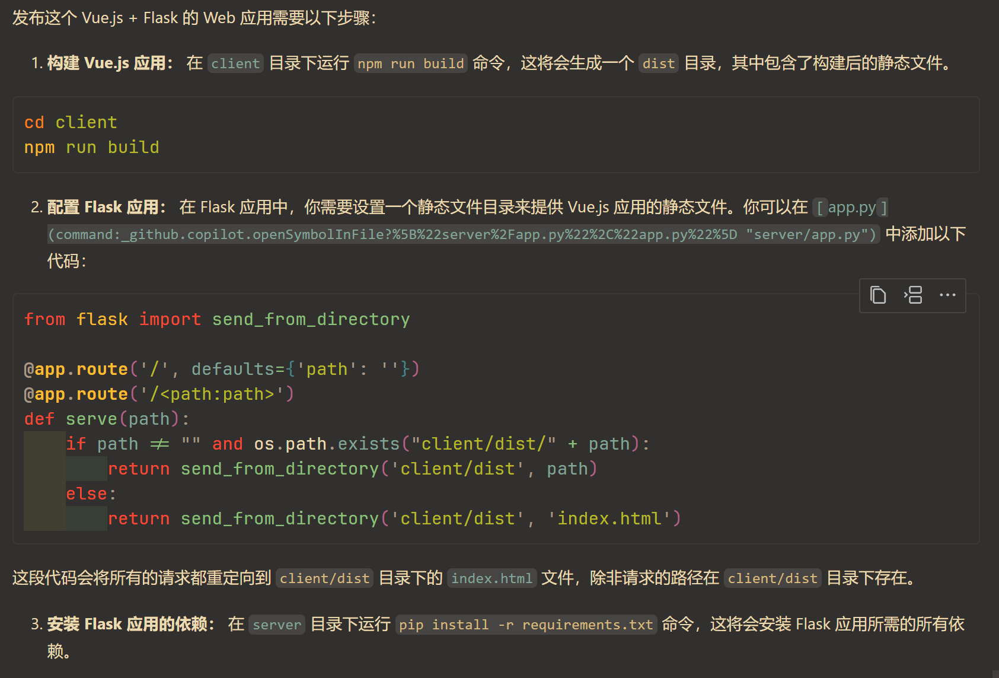

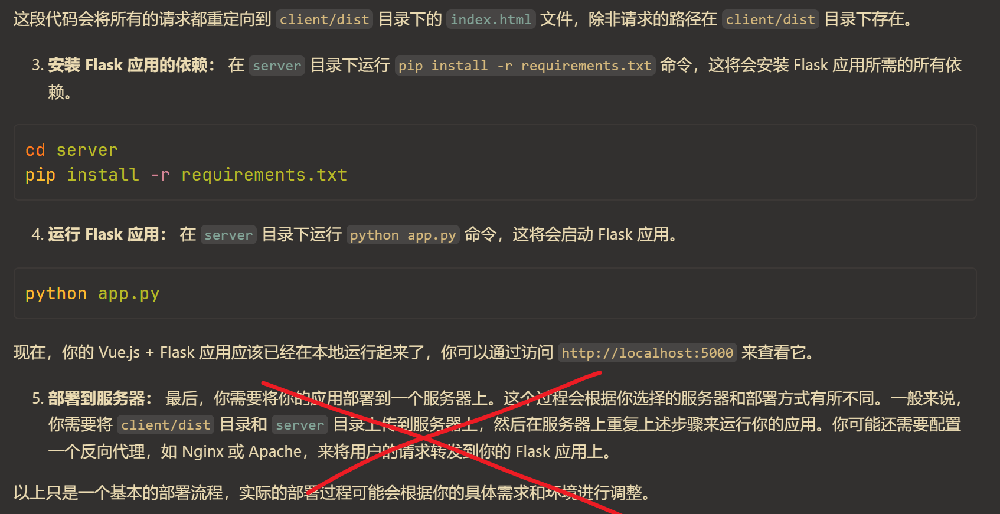

以及一些数据存储的信息。

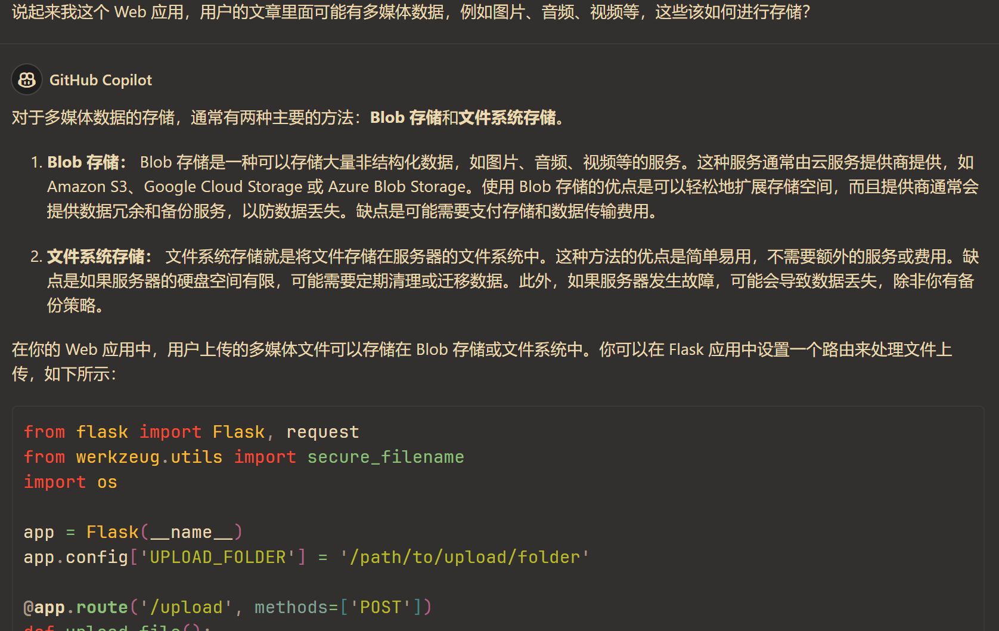

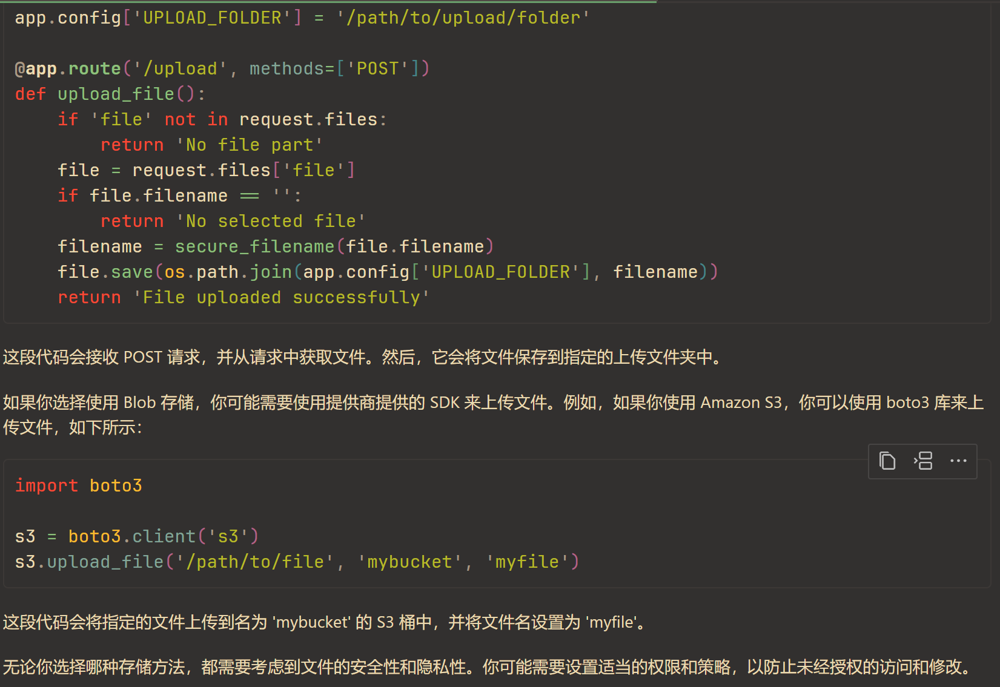

### 代码规范

为了统一代码格式，全组在组长的要求下安装了 Black Formatter 等插件，并开启了保存自动格式化的功能。

除此以外，约定后端 Python 代码采用 Snake 命名法（`get_data_reference`），而前端 Vue.js 代码采用 Camel 命名法（`getDataReference`）。

### 代码框架

#### 搭建

毫无 Web 开发经验的组长，在网上翻阅了很多资料，堪堪摸索出一条搭建项目框架的路线。

为了与组员保持一致，组长也最终放弃了在 WSL 进行开发的决定。

安装 Node.js, Python 等基本内容不再赘述。

首先是安装 Vue.js 命令行，这样就能直接使用 `vue` 命令。使用下面的命令进行安装（可能需要配置 NPM 镜像）：

```
npm install -g @vue/cli
```

随后创建前端项目

```
vue create client
```

然后创建 Python 虚拟环境

```
python -m venv .venv
```

启动虚拟环境

```
source .venv/Scripts/activate
```

然后安装 Flask

```
pip3 install flask
```

紧接着创建后端文件夹 `server`

```
mkdir server
```

在其中创建一个 `app.py` 作为应用的入口文件，并根据 Copilot 的指导，输入以下内容：

```py
from flask import Flask, jsonify

app = Flask(__name__)


@app.route("/api/data", methods=["GET"])
def get_data():
    data = {"message": "Hello, Vue.js!"}
    return jsonify(data)


if __name__ == "__main__":
    app.run(debug=True)
```

同时修改 `client/src/components/HelloWorld.vue` 组件中 `script` 标签为

```js

export default {
  name: 'HelloWorld',
  data() {
    return {
      message: 'Loading...'
    };
  },
  async mounted() {
    const response = await fetch('/api/data');
    const data = await response.json();
    this.message = data.message;
  }
}
```

并修改 `client/vue.config.js` 为

```js
const { defineConfig } = require('@vue/cli-service')
module.exports = defineConfig({
  transpileDependencies: true,
  devServer: {
    proxy: {
      '/api': {
        target: 'http://localhost:5000',
        changeOrigin: true,
      }
    }
  }
})
```

以将 Vue.js 的 API 请求转发到 5000 端口，供后端进行处理。

最后使用两个 Bash 终端分别在后端 `server` 和前端 `flask` 执行 `flask run`（或 `flask run --reload`）和 `vue serve` 启动前后端进行检查。

成功启动后，按指示打开 `https://localhost:8080`，并使用 <kbd>F12</kbd> 打开开发者工具，在网络选项卡使用 <kbd>Ctrl</kbd> + <kbd>R</kbd> 刷新后，成功发现 data 名称的 GET 请求，同时状态码返回 200，并能看到预期的 JSON 数据，验证成功。

#### 复刻

下一个难题便是如何让组员本地获得与组长相同的环境。经过摸索，组长也发现了下面的路径。

首先组长导出需要安装的 Python 依赖

```
pip3 freeze > server/requirements.txt
```

随后组员按下面的步骤进行重复操作，即可复刻组长的本地环境。

1. Git
    1. 同步 main 分支（先切换到 main 再切回来）
    2. 合并 main 分支更改（分支 > 合并 > main）
2. Python 虚拟环境
    1. `python -m venv .venv`
    2. `source .venv/Scripts/activate`
    3. `pip3 install -r server/requirements.txt`
3. Node.js 包
    1. `npm install -g @vue/cli`
    2. `cd client`
    3. `npm install`
4. 运行并测试
    1. `flask run`
    2. `vue serve`

至此便完成了框架的搭建。

组长也将 VSCode 设置一并传入库中，免去了组员的设置之苦（当然格式化工具还是手动帮助组员完成了设置）

```json
{
    "editor.formatOnSave": true,
    "editor.formatOnPaste": true
}
```

完成上面的工作后发布了 Pull Request [#3 初始化项目框架](https://github.com/pilgrimlyieu/ELProject/pull/3)。

然而因为组长设置了 main branch 保护机制，必须要一个 Review Approve 才能合并到主分支，而组长不能审阅自己的代码，组员也并不了解其中的机制，无奈之下组长给 Repo Admin 开了 bypass，并强行合并了 PR。

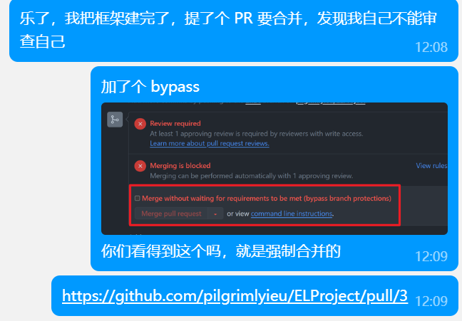

### 资料

组长也搜罗了很多资料供组员进行参考。

- 3W(HTML, JavaScript, CSS)
    - [HTML 简介](https://developer.mozilla.org/zh-CN/docs/Learn/HTML/Introduction_to_HTML)
    - [重新介绍 JavaScript（简短 JS 教程）](https://developer.mozilla.org/zh-CN/docs/Web/JavaScript/Language_overview)
    - [JavaScript 教程](https://zh.javascript.info)
    - [CSS 入门概述](https://developer.mozilla.org/zh-CN/docs/Learn/CSS/First_steps)
    - [W3School](https://www.w3school.com.cn)
        - [HTML 请求方法](https://www.w3school.com.cn/tags/html_ref_httpmethods.asp)
- 前端
    - [Vue.js 文档](https://cn.vuejs.org/guide/quick-start.html)
- 后端
    - [Flask 中文文档](https://dormousehole.readthedocs.io/en/latest)
    - [Flask 英文文档](https://flask.palletsprojects.com/en/3.0.x)

目前组长本人看完了 3W 的概述，快速翻阅了 JavaScript 的基本语法、面向对象语法、回调与模块等，以及 Vue.js 和 Flask 的快速上手部分。

并为了节约时间，向组员提出了一些阅读建议：

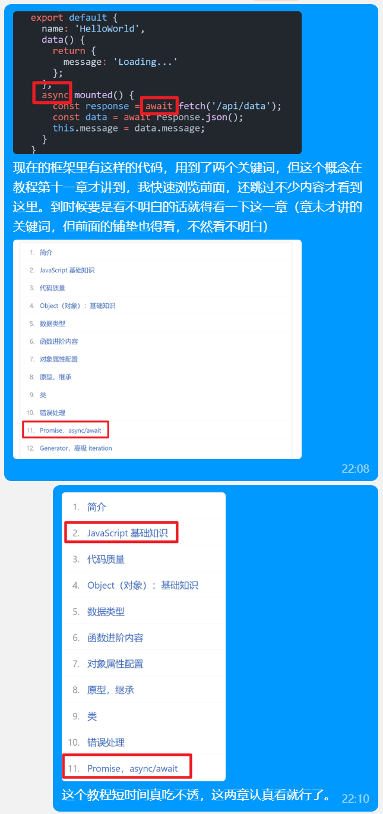

未来也许会对这些资料继续进行补充。

## 会议内容

- 组长协助组员完成合并主分支操作，及环境复刻等
- 前后端分别讨论并制定开发路线图，进一步确定部分细节、分工与 DDL 等内容，~~组长划水~~
- 组长进一步介绍 Pull Request 发布流程，并正式开始开发

### 开发线路图

#### 前端

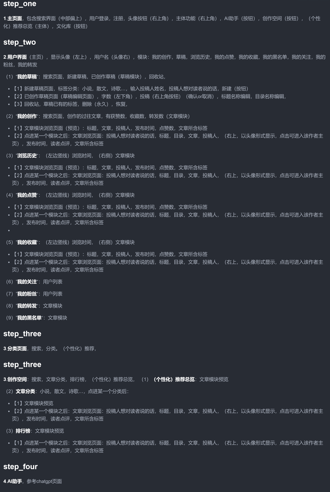

前端开发路线图初稿

- 前端组成员
    - [@EnndWang](https://github.com/EnndWang)
- 撰写人：[@EnndWang](https://github.com/EnndWang)

#### 后端

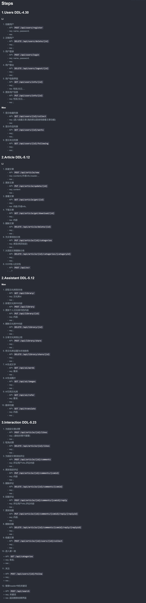

后端开发路线图初稿

- 后端组成员
    - [@t0mo0n](https://github.com/t0mo0n)
    - [@KashingLiking](https://github.com/KashingLiking)
- 撰写人：[@t0mo0n](https://github.com/t0mo0n)

### 流程

写代码与合并更改流程：
1. 写代码前，切换到 main 分支，同步 GitHub 的更改，再切回来
2. 如果 main 上有更新，将 main 上的更新合并到自己的分支上
3. 写代码……
4. 每完成一个部分（一个部分的界定可以有自己的理解），提交一个 Pull Request，写好标题，同时内容详细说明这个 Pull Request 实现了什么，我会尽快审查合并或提出建议
5. 或者完成了一天的代码工作，今天不会更新了，即使一个函数或某个部分还没写完，也先用注释标记未完成部分，提交一个 Pull Request，跟上面一样，而且需要另外说明未完成的部分

- 打开后端：先启动 Python 虚拟环境，再在 server 文件夹打开 Bash，运行 `flask run`（或 `flask run --reload`）
- 打开前端：在 client 文件夹打开 Bash，运行 `vue serve`
- 关闭前/后端：<kbd>Ctrl</kbd> + <kbd>C</kbd>
