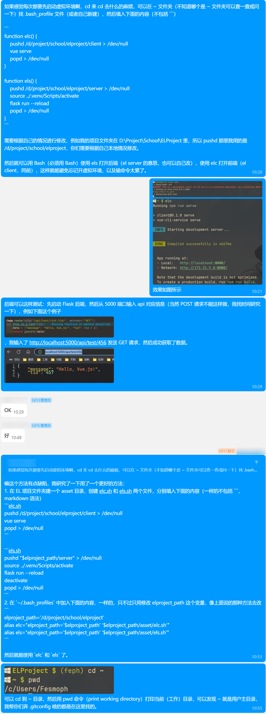
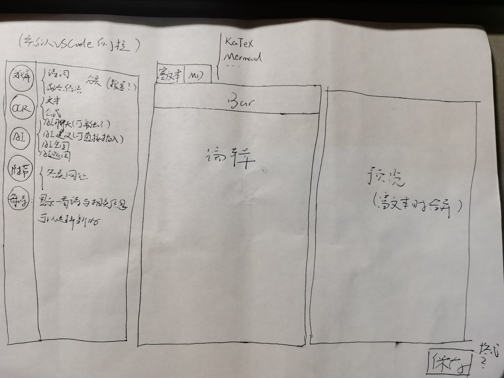
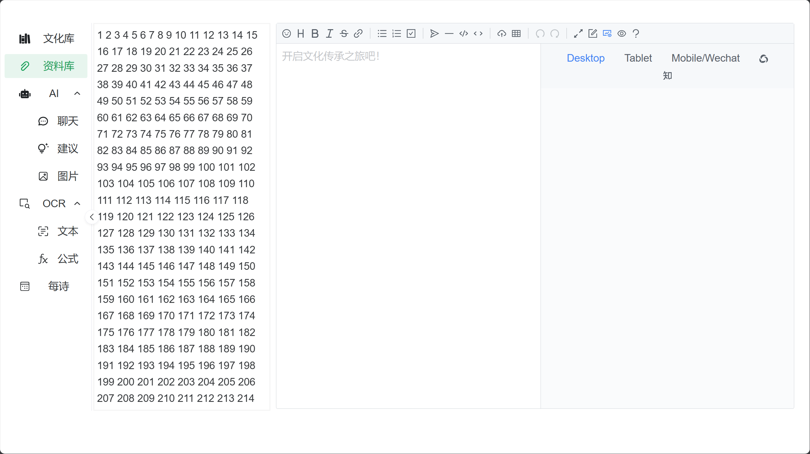

# 5 月 10 日记录

- 记录人：[@PilgrimLyieu](https://github.com/pilgrimlyieu)
- 记录时间：2024 年 5 月 10 日

距离上次记录已经过去快三周了，随后因为期中考试中断了一次组会，在五一我也忙着开发，也没来得及对当前进度进行记录。恰逢今日是中期报告 DDL，于是借此机会总结一下近段时间的工作进度，同时为中期报告提供素材。

## Bash

由于前后端调试的命令过于冗长，如后端需要先启动虚拟环境再启动 Flask 服务，因此我写了两个 Bash 脚本 `elc.sh`（EL Client）与 `els.sh`（EL Server），放在了项目 `asset` 文件夹，内容分别如下：

```bash
pushd "$elproject_path/client" > /dev/null
vue serve
popd > /dev/null
```

```bash
pushd "$elproject_path/server" > /dev/null
source ../.venv/Scripts/activate
flask run --reload
deactivate
popd > /dev/null
```

随后在 `~/.bash_profile` 加入如下别名，并将对应 `elproject_path` 赋值为自己的 EL 项目路径：

```bash
elproject_path='/d/project/school/elproject'
alias elc="elproject_path='$elproject_path' '$elproject_path/asset/elc.sh'"
alias els="elproject_path='$elproject_path' '$elproject_path/asset/els.sh'"
```

这是最终改进版本，一开始用的是在 `.bash_profile` 定义两个函数，但是考虑到如果用 <kbd>Ctrl</kbd> + <kbd>C</kbd> 中止 Vue 或 Flask 服务时，会直接终止函数，也即不会回到执行命令时的地方，后端也不会退出 Python 虚拟环境，因此在查阅相关资料后改为了使用外部脚本。



图中是 QQ 群聊天记录中的初版，也有一些错误，后面修正了。

## 资料

四月底通宵时发现了一个仓库：[javayhu/poetry](https://github.com/javayhu/poetry)，里面存储了古诗文网的数据，包括诗词、作者甚至还有标签等信息，出乎我的意料。

```json
{
  "about": "创作背景\n\n　　唐玄宗天宝初年，李白xxx",
  "content": "君不见，黄河之水天上来，奔流到海不复回。xxx",
  "dynasty": "唐代",
  "fanyi": "译文\n你难道看不见那黄河之水从天上奔腾而来，波涛翻滚直奔东海，从不再往回流。xxx",
  "id": 7722,
  "name": "将进酒",
  "poet": {
    "desc": "李白（701年－762年），字太白，号青莲居士，唐朝浪漫主义诗人，被后人誉为“诗仙”。xxx",
    "id": 247,
    "image": "https://raw.githubusercontent.com/hujiaweibujidao/poetry/master/image/image_247.jpg",
    "name": "李白",
    "star": 0
  },
  "shangxi": "鉴赏\n\n　　将进酒，唐代以前乐府歌曲的一个题目，内容大多咏唱饮酒放歌之事。xxx",
  "star": 32615,
  "tags": [
    "乐府",
    "唐诗三百首",
    "咏物",
    "抒情",
    "哲理",
    "宴饮"
  ]
}
```

```json
{
  "content": "轶事典故\n\n姓名由来\nxxx",
  "desc": "李白（701年－762年），字太白，号青莲居士，唐朝浪漫主义诗人，被后人誉为“诗仙”。xxx",
  "dynasty": "唐代",
  "id": 247,
  "image": "https://raw.githubusercontent.com/hujiaweibujidao/poetry/master/image/image_247.jpg",
  "name": "李白",
  "star": 4895
}
```

这让我比较头疼的数据方面得到了解决。

同时在五一期间，让 Copilot 写了两个 Python 脚本 `cutData.py` 与 `extractTags.py` 对这些数据作进一步的处理。

```py
import os
import json
import heapq


def keep_top_star_files(directory, count):
    # 创建一个列表来存储 (star, filename) 对
    star_files = []

    # 遍历目录中的所有文件
    for filename in os.listdir(directory):
        with open(os.path.join(directory, filename), "r") as f:
            data = json.load(f)
            star = data.get("star", 0)
            star_files.append((star, filename))

    # 只保留 star 数量排名前 count 的文件
    top_star_files = set(file for star, file in heapq.nlargest(count, star_files))

    # 删除 star 数量不在前 count 的文件
    for filename in os.listdir(directory):
        if filename.endswith(".json") and filename not in top_star_files:
            os.remove(os.path.join(directory, filename))


# 使用函数
count = 1000
source = "./poetry"
keep_top_star_files(source, count)
```

原数据足有 72000+ 的诗词，出于性能方面以及只是一个玩具的考量，仅保留了 star 排名前 1000 的诗词。

```py
import os
import json

# 创建一个空字典来存储标签和对应的诗词信息
tags_dict = {}

source_folder = "./poetry"
target_folder = "./tag"
star_count = 10

# 遍历文件夹中的每个 JSON 文件
for filename in os.listdir(source_folder):
    with open(os.path.join(source_folder, filename), "r", encoding="utf-8") as f:
        data = json.load(f)
        tags = data["tags"]
        for tag in tags:
            if tag not in tags_dict:
                tags_dict[tag] = []
            tags_dict[tag].append({"id": data["id"], "star": data["star"]})

# 对字典中的每个标签，将其诗词列表按照 star 数递减的顺序排序
for tag, poems in tags_dict.items():
    tags_dict[tag] = sorted(poems, key=lambda x: x["star"], reverse=True)
    for pid, poem in enumerate(tags_dict[tag], start=1):
        poem["pid"] = pid

# 计算每个标签的前几首诗词的 star 总和
tag_star_sum = {
    tag: sum(poem["star"] for poem in poems[:star_count])
    for tag, poems in tags_dict.items()
}

# 根据 star 总和排序标签
sorted_tags = sorted(tag_star_sum.items(), key=lambda x: x[1], reverse=True)

# 将排序后的数据写入新的 JSON 文件
for tid, (tag, _) in enumerate(sorted_tags, start=1):
    poems = tags_dict[tag]
    with open(
        os.path.join(target_folder, f"{tid:03d}-{tag}.json"), "w", encoding="utf-8"
    ) as f:
        json.dump(
            {"tid": tid, "tag": tag, "sum": len(poems), "poems": tags_dict[tag]},
            f,
            ensure_ascii=False,
            indent=4,
        )
```

单独抽离出了标签信息，以及每个标签下的诗词信息，这样就可以方便按标签列举诗词了。

## 变化

四月底时，焦虑于进度缓慢，无从下手，深感无力。之前宏伟的构想，现在看来也只是空中楼阁，不切实际。于是我个人做出了决定，只关注最初构想中与主题最为相关的核心功能，也即编辑器附上文化库，便是我们最大的特色。

因此我也私自做了决定，重新进行了构想。画出了下面的框架图，决定以这为目标进行开发。



也不知是应该值得庆幸还是，组员们五一期间并没有作出什么实质性的 commit，因此我做了这样大方向的调整也没有太大的心理负担。

因此也顺带关闭了 #4 ~ #11 这 8 个跟踪项目开发进度的 issue。手动关闭一个后感觉挺慢挺累的，于是决定使用 `gh` 命令行进行关闭：

```bash
for i in {4..11}; do gh issue close --reason "not planned" $i; done
```


于是我五一开始朝着这个方向，全身心投入开发前端，目前进度如下：



这个项目中我感受最深的便是无力，由于毫无 Web 应用开发经验，甚至是怎么问、怎么查这样最基础的问题也都是束手无策，只能自己不断和 Copilot, Google, StackOverflow 斗智斗勇，摸着石头过河。

五一期间大体就完成了框架，并在实践过程中决定放弃了富文本编辑器，因为引入的 markdown 编辑器足够好了，同时也有 WYSIWYG(What You See Is What You Get, 所见即所得) 的特性，也足以承载其承担富文本编辑器的功能。

即使是最简单的一个点击左侧 Menu 切换类 VSCode 侧边栏内容组件的功能，我也是费了九牛二虎之力才弄出来了，确实是心力憔悴。

现在的任务便是将左侧的几个组件进行实现。

- 文化库：有很多按标签分类的诗词，可以通过点击了解详细信息，并且可以插入到编辑器中。也是项目的特色功能。
- 资料库：提供一些文化相关的网站进行参考，如古诗文网与一些古籍网站等。可能是这几个组件中实现起来最为容易的一个了，只需要贴上图片和名称，再附上链接即可。
- AI：本计划提供聊天、建议和图片三种功能，但是可能能力与时间不足以支撑完成这个功能，因此优先级最低。
- OCR：算是我自己的小私货，优先级次之。
- 每诗：名字起得不太好，暂时没想到更好的。简而言之就是随机显示文化库中一首诗词与相关信息，对用户进行诗意的熏陶。

大概优先级是「文化库」>「每诗」>「资料库」>「OCR」>「AI」。难度我估计是「AI」>「文化库」>「OCR」>「每诗」>「资料库」。

由于我目前全部投入到前端的工作中，也不知道后端方面该如何开展工作，甚至不知道还有没有必要后端，似乎可以全由前端方面来完成。

再加上项目方向的大变动，初版的 API Reference 已经跟当前的方向相差甚远了，因此我也[弃用了 API Reference](https://github.com/pilgrimlyieu/ELProject/commit/fda4df8c48d5d87c46f8db2e76c7b2f0ac7fb316)。

## 变故

6 号的时候负责前端的组员私聊告诉我，因为个人原因以及对项目无从下手，决定退出了项目。私聊内容出于隐私原因不便在此给出。

我同意了请求，并接过了前端开发的任务，目前项目的前端开发全部由我来负责。


