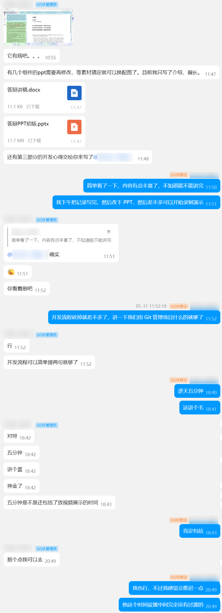
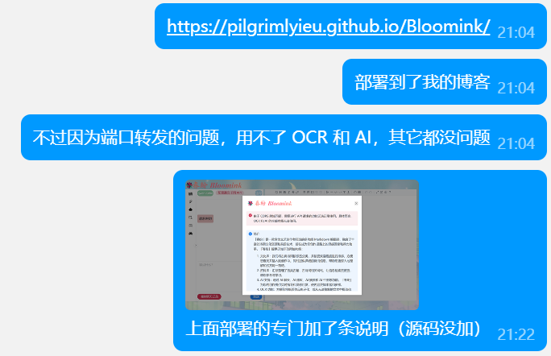
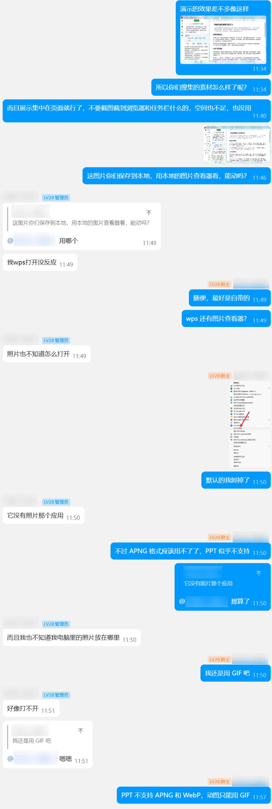
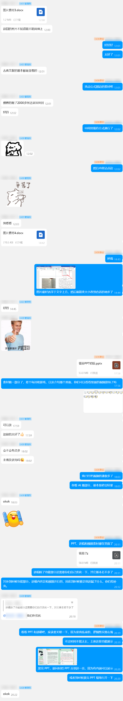
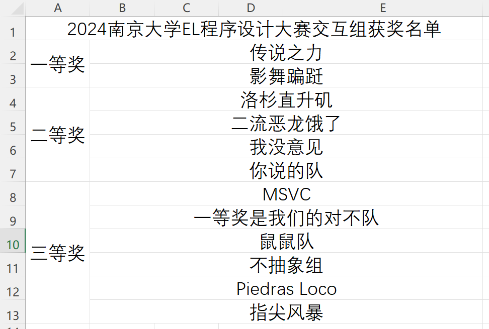
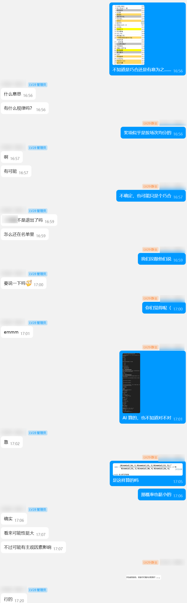
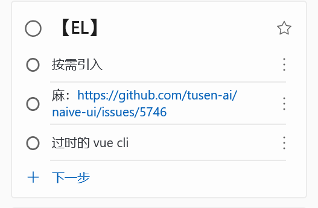

# 6 月 9 日记录

- 记录人：[@PilgrimLyieu](https://github.com/pilgrimlyieu)
- 记录时间：2024 年 6 月 9 日

首先恭喜一下我们组作品最终获得三等奖！

## 项目结构

[eza](https://github.com/eza-community/eza) 真好用，本来还打算去装个 tree，然后发现 eza 自己就有树状功能，还可以显示图标。差不多就是下面的命令，然后手动修正了一点。

```bash
eza --tree --level=2 --group-directories-first --icons .
```

有时间时要总结一些现代化的内置工具替代品。

## 答辩材料

由于手机 QQ 清理了下聊天记录，因此又要用电脑截了。


准备答辩材料的素材。



答辩时间一砍再砍，最后只剩下五分钟，因此只能迅速略过去，完全无法细讲。



还研究了一下，将项目部署到了我的 GitHub Pages 上面。由于没有后端，跨域访问的问题导致 OCR 与 AI 的功能是无法使用的。

同时因为我们项目的结构（建项目时还不太了解，而且最初计划有后端）还额外建了两个分支，一个用来对 GitHub Pages 专门修改了部分（如资源链接，以及跨域问题的说明等），另一个`gh-pages` 分支用 `git subtree` 的命令推送过去，用来部署。

因为对 `main` 分支的保护，所以也不能用 GitHub Actions 自动部署。



使用 ScreenToGif 录制演示动图。本来想使用更现代化的 APNG 与 WebP 格式，结果 PPT 都不支持，只好回归 GIF。

然后意外地发现 ScreenToGif 还能录制 MKV，本来打算用 OBS 的，ScreenToGif 录 MKV 还挺方便的。然后 PPT 预览 MPV 效果还不错，而且后面基本上都要比较长的演示（虽然实际上也不超过十秒），所以就一张 GIF，剩下都是 MKV。

弄 ScreenToGif 时还意外修复了一个之前遇到过挺多次的问题，不过这就是题外话了，我大概后面会在博客的记事板上记录。



我拿到 PPT 初稿后，修改了里面的文字、格式等，同时补充了各种图片，录制了全部的演示视频，用以演示的那个「荆轲刺秦」文字稿也是我找的，还蛮契合的。

答辩讲稿好像没上传到 GitHub 上，就在下面贴吧。

```
1：这是我们的作品——「春纷」，各位有条件的也可以访问红字链接一起体验，不过因为特殊原因，一些功能无法使用。以及我们全组都没有相关开发经验，因此对于作品中一些问题也请理解海涵。
3~7：背景与设计理念因时间不足，而且中期文档有所阐述，不再赘述。
8：（PPT）
9：熟悉 Markdown 语法的小伙伴们肯定不陌生，我也不在此赘述。但我们这个编辑器的优越之处就在于，可以像富文本编辑器那样去使用它，这里的视频简单呈现了一下一些用法。
10：编辑器还有很多用法：比如可以全屏专心创作；还有可能有人像我一样更喜欢分屏预览，而非那样所见即所得的模式；还可以专心欣赏自己的作品。
11：与此同时，预览界面上面有几个按钮，可以提供不同平台的呈现效果。还可以一键复制到微信公众号和知乎，实现分享传播的目的。
12：我们的文化库搜集了千首诗词名篇，按标签进行分类，同时每首诗词都提供了详实的翻译、赏析等相关信息，能让用户沐浴在诗词的海洋当中。
13：同时也有插入功能，便利了用户。
14：接下来是我们的资料库。考虑到用户可能有搜索中文信息的需求，但苦于没有渠道获取信息，所以我们提供了资料库供用户使用，同时也弥补我们网站内资料相对有限的局限性。
15：当然，还可以调用本地词典。
16：然后便是我们的重磅功能，也就是 AI 功能。
17. 当然模型和用户名都是可配置的。而且聊天记录被缓存。
18. 也可以让 AI 总结用户的作品，抑或是提供一些建议。
19：AI 还可以生成相关的图片。这几个是占位图。如果选择「重新生成题图」，那么会先生成一个 prompt，紧接着再生成图片，由于这个时间比较漫长，用户在此期间也可以自由地做自己想做的事情。如果对这批图片不满意，则可以使用旧 prompt 再进行一次生成，这样也可以节约时间。
20：用户可以放大查看图片细节，并将其插入到作品当中，真正融入作品。
21：也有很多用户有将纸质作品电子化等将图片转文字的需求，我们的 OCR 功能满足了这个需求。底下也有置信度条，可以看出来准确率还是相当高的。
22：我们也提供了 LaTeX 的公式识别。也可以自行设定数学公式分隔符。
23：还有随机诗词，给你不一样的惊喜。
24：还有放松的游戏。高中时流行了一个叫 Wordle 的游戏，而这些游戏可以算是中文版的 Wordle，这里演示一个比较简单的。
26：我们小组学习了现代开源项目的工作流程，使用 Git 进行版本管理，并将项目托管在 GitHub 上，组员在各自分支上工作，随后通过 Pull Request 的方式进行贡献，经代码审核后再合并进入主分支。
27：同时我们也通过文字的形式将开发的过程记录下来。
29：（简单念几句内涵）我们在中期文档中也已经写明了，因为时间不足的原因，我们原本预想的一个多用户的创作平台也并未能实现。除此以外，还有将传统文化传播至海外的多语言构想以及一些更细节的功能，也没能实现。
```

当然实际上基本没有按上面讲，漏讲了挺多，以及后面还有计划要讲的可能也匆忙间忘记了，也有点随机应变。

除了非常长的部分是照着稿子念的外，其它基本就是粗略带过了。

## 答辩

共 32 组，我们组是第 26 组。我大概在 17 组左右时去听了。

实际进程比计划的慢上一组。我到时大概三点半以后。

看了几组感觉都非常厉害，我不仅惊叹于他们的创意，还震撼于他们的技术。尤其是看到了 VR 那组，我看完就感觉他们组能拿一等奖，果不其然。

本来让组员我讲漏的补充，不过我也讲得飞快，话筒声音也很大，完全没有插话的机会。

讲完后，评委没有提问……于是我感觉就要寄了，本来就创新不足，再没提问，似乎就是不感兴趣、不看好。然后再对比其他组的优秀作品，愈发觉得得奖希望渺茫。

因此最后能得奖时还是很意外惊喜的，也算是为这两个月的努力画上了一个圆满的句号。

我讲完后又看了几组，不过没看完就去吃饭了。吃完饭再赶回来颁奖典礼。


当时的记录（后面的因为超长度了没截上，也懒得再截了）。



获奖名单



然后我去划定了一下获奖队伍的答辩顺序，想凭借印象回忆一下其它获奖的作品，意外发现了一个「巧合」——获奖按上下两个场次均分。

然后算了下概率，概率还挺小的（不过还不算小概率事件）。

## 其它

然后是其他的记录。在开发过程中用 Microsoft Todo 记录了点「灵感」，打算后面在文档弄的。



这个是 5 月 3 日建立的，只有三个，而且第三个也已经讲过了。

这么说来的话，可能还想再开个新记录，根据代码来讲讲。不过这个应该越早越好，后面就忘记了。

### 按需引入

这好像也没啥好说的，根据 Naive UI 的文档完成了，还挺方便的。

### Naive UI 问题

居然剩下两个稍微能讲的都与 Naive UI 有关。

我在用 Naive UI 的 Modal 组件时，发现把预设 preset 设置为 card，内容 content 无法显示，折腾了很久，也查了很多内容，但都没能找到类似的问题。

一般遇到诡异的问题肯定是先找找自己的原因嘛，但是真的太奇怪了，撞得头破血流都没找到问题所在。

后面也不知道是在 GitHub 仓库搜索，还是从 Google 搜到的，居然是 [Naive UI 自己的问题](https://github.com/tusen-ai/naive-ui/issues/5746)……

这个问题在 2.38.2 修复，但是当时还没发布，我当时用的版本是 2.38.1。

找到这个问题时，Todo 上面写的「麻」很好地概括了我当时的内心状况。

[后面更新到了 2.38.2](https://github.com/pilgrimlyieu/Bloomink/commit/65f2d95a6d3c817f356c8ea2623d1481bbaf3e65)（在 [PR：完成 `CultureLibrary` 组件](https://github.com/pilgrimlyieu/Bloomink/pull/14)中），问题解决。
